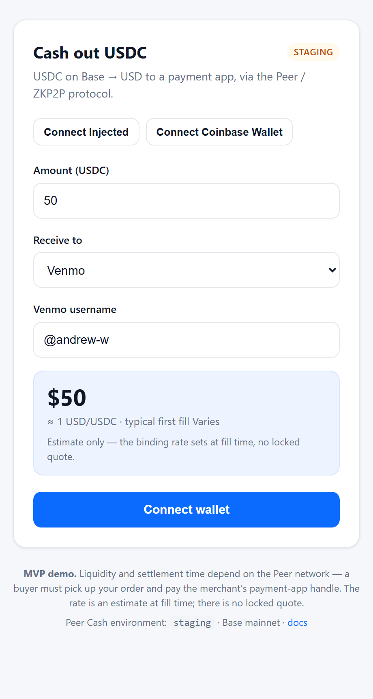

# Peer Cash-out Widget (MVP)

A minimal single-page React app that lets a user **cash out Base USDC to USD
fiat** (Venmo, Wise, Revolut, Cash App) through the
[Peer / ZKP2P](https://docs.zkp2p.xyz) protocol, using the official
[`@zkp2p/cash`](https://www.npmjs.com/package/@zkp2p/cash) SDK.

The person cashing out is the **maker**: their USDC is deposited into the
protocol's escrow, a **buyer** pays the merchant's fiat handle (Venmo/Wisetag/
Revtag/Cashtag) directly, proves the payment with a TEE attestation, and the
protocol releases the USDC to the buyer. No bank account, KYC, or centralized
off-ramp provider involved.

> **This is an MVP demo.** It is not production-ready for high volume. It shows
> the full cash-out flow — connect → estimate → deposit → watch → deliver —
> so an ecommerce site can later embed or adapt it.



---

## Stack

- **Vite + React + TypeScript**
- **wagmi + viem** — wallet connection & signing on Base
- **`@zkp2p/cash`** — the Peer Cash SDK (`createCashClient`, `estimate`,
  `cashout`, `order` / `watch`, `withdraw`)
- Plain CSS — no design system, no backend, no auth.

## Run it locally

```bash
npm install
npm run dev          # http://localhost:5173
```

Other scripts: `npm run build` (typecheck + bundle) and `npm run typecheck`.
`node scripts/capture-demo.mjs` regenerates `public/demo.png` (the screenshot
above) — it renders the live app in headless Edge, so start `npm run dev` first.

### What you need to actually cash out

1. **A browser wallet** (MetaMask, Rabby, Coinbase Wallet, …) with **Base
   mainnet** selected — the SDK refuses other chains (`SIGNER_CHAIN_MISMATCH`).
   The app shows a "Switch to Base" button if needed.
2. **Base USDC** in that wallet. There is no faucet: every environment of the
   Peer Cash SDK runs against real Base mainnet USDC (see below).
3. **A real payee handle** on the chosen platform — a Venmo username, Wisetag,
   Revtag, or Cashtag that actually exists and is controlled by the merchant.
   Handles are validated against the live platform at registration.
4. **A buyer on the Peer network** to pick up your order. On staging, order
   volume is low, so expect to wait (or withdraw later).

> Tip: you can verify the whole integration against a 1–2 USDC cash-out and
> then `withdraw()` — see the "How the flow works" section. The SDK's own
> staging verification checklist lives in its
> [AGENTS.md](https://github.com/zkp2p/peer-cash/blob/main/AGENTS.md).

### Configuration

| Variable | Values | Default | Notes |
| --- | --- | --- | --- |
| `VITE_CASH_ENV` | `staging` · `preproduction` · `production` | `staging` | Selects the Peer curator/indexer API. |

⚠️ **Important:** the environment selects the *API backend only*. All three
environments use the **same Base mainnet chain and real Base USDC**. There is
no testnet for this flow — "staging" just points at the staging curator API
(safer for testing integrations, but funds are still real).

## How the flow works

1. **Connect** — wagmi connects the wallet; the app reads the wallet's Base
   USDC balance via `useReadContract` (viem `erc20Abi`).
2. **Estimate** — `cash.estimate({ amount, currency: 'USD', platform })`
   returns the live Chainlink oracle rate (`≈`, **never a locked quote**; the
   binding rate resolves when a buyer fills). A debounced call refreshes it as
   you type. `cash.fillStats()` adds a historical "typical first fill" ETA and
   fails open to "Varies".
3. **Cash out** — `cash.cashout({ amount, receive: { platform, currency,
   payee } }, { signer })`:
   - registers the payee with the Peer curator,
   - approves + deposits your USDC into the protocol escrow,
   - for **Venmo / Cash App** (restricted rails) also attaches the
     access-policy groups in a follow-up transaction,
   - returns `{ depositId, txHash, order }`.
4. **Watch** — `cash.watch(depositId)` streams order state changes until a
   terminal state:
   `awaiting-buyer → matched → delivering → delivered` (paid + proven) or
   `returned` (no buyer; no separate "failed/cancelled" state in this SDK).
   `order.explain()` provides a one-line human status.
5. **Withdraw** — the **only** unwind verb: `cash.withdraw(depositId, {
   signer })` prunes expired intents and returns your USDC. It's shown whenever
   `order.nextActions` includes `withdraw` — no heuristics.

### Errors

Every failure is surfaced through a friendly message. The SDK throws typed
`CashError`s with `code`, `retryable`, and `remediation`; the app maps common
codes (`INSUFFICIENT_TOKEN_BALANCE`, `TRANSACTION_REJECTED`,
`PAYEE_VERIFICATION_REQUIRED`, `SIGNER_CHAIN_MISMATCH`, `ORDER_NOT_FOUND`, …)
to human copy. Wallet-rejected transactions are detected via
`isUserRejectedError` ("You cancelled the wallet request").

## Project structure

```
peer-cashout-widget/
├── index.html
├── vite.config.ts / tsconfig.json
├── src/
│   ├── main.tsx               wagmi + react-query providers
│   ├── config.ts              environment, chain, currency — the only config
│   ├── wagmi.ts               wagmi config (Base + injected/Coinbase connectors)
│   ├── App.tsx                screen switch (form ⇄ order) + localStorage resume
│   ├── lib/
│   │   ├── cash.ts            shared CashClient, capabilities, friendlyError()
│   │   └── useOrderStatus.ts  order() + watch() hook (resumable, terminal-aware)
│   └── components/
│       ├── CashoutForm.tsx    form, live estimate, submit
│       └── OrderStatus.tsx    live status, withdraw, resume
```

## Current limitations

- **Liquidity / settlement time depends on the Peer network.** A buyer must
  pick up your order and actually pay the merchant's fiat handle. On staging
  there is little volume; even in production it's not instant. `estimate().eta`
  is historical, never a promise.
- **Proof times vary.** The buyer's TEE-TLS attestation takes time; `delivered`
  only lands once the payment is proven on-chain.
- **Not production-ready for high volume:** no backend, no auth, no order
  reconciliation job, single-currency (USD), public RPC, and the bundle is
  large because the full SDK ships in one page. An ecommerce deployment would
  add a server, keyed RPC, webhooks/reconciliation, and a proper UI kit.
- **Wise and PayPal** need a verified identity for *new* handles (first-party
  Peer web obtains this via the Peer TEE browser extension). The app flags this
  in the UI; already-registered handles work fine.
- **No secrets are hardcoded anywhere** — no private keys, no API keys. All
  signing happens in the user's wallet.

## Adapting this into an ecommerce widget

The app is deliberately prop-shaped so it can become an embeddable widget:

```tsx
// Merchant checkout page
<CashoutWidget
  initialAmount="249.99"                 // pre-fill from the cart total
  initialPayee="@acme-store"             // the MERCHANT's payout handle
  initialPlatform="venmo"
  onTerminal={({ depositId, state }) => {
    if (state === 'delivered') markOrderPaid(depositId); // callback on success
    else offerRefund(depositId);                          // callback on no-buyer
  }}
/>
```

- **Props**: `initialAmount`, `initialPayee`, `initialPlatform`, `onTerminal`
  (fires once per order at `delivered` / `returned`). See `CashoutWidgetProps`
  in `src/App.tsx`.
- **URL pre-fill** (no props needed): `/cashout?amount=25&payee=%40acme&platform=venmo`.
- **Redirects**: listen for `onTerminal` and `window.location` redirect to
  your order-confirmation page; or keep the widget inline and swap the form
  for your receipt UI.
- **Persistence**: the widget saves `depositId` to `localStorage` and resumes
  the order on refresh — your ecommerce backend should do the same server-side
  (`depositId` is the entire integration state; the order rebuilds from the
  chain by that id alone).
- **Merchant payee, not shopper payee**: the buyer pays whoever the handle
  belongs to, so pass *your* store's payout handle — that's the whole point of
  the widget from an ecommerce perspective.

## How this stays safe

- Funds live in the **protocol escrow contract**, not in this app, and only
  the maker (your connected wallet) can withdraw an unmatched deposit.
- Everything is resumable: close the tab mid-order, come back, and
  `order(depositId)` rebuilds the state from the chain.
- Every transaction carries ERC-8021 attribution (`peer-cash`,
  `peer-cashout-widget`) so integrations are visible on-chain.

## References

- [@zkp2p/cash on npm](https://www.npmjs.com/package/@zkp2p/cash)
- [peer-cash repository & AGENTS.md](https://github.com/zkp2p/peer-cash)
- [Peer / ZKP2P docs](https://docs.zkp2p.xyz)
